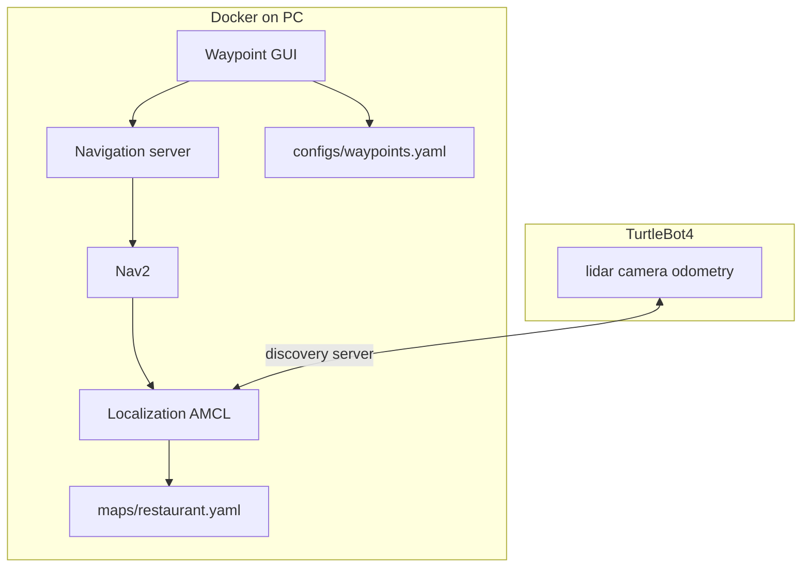

# Navigation

You own **map usage**, **waypoints**, and **navigation readiness** for the Steel City Restaurant Challenge. Navigation runs on your PC inside Docker and talks to the TurtleBot4 over the discovery server. The robot provides sensors and movement; Docker runs localization, Nav2, and the competition navigation server.

## What runs where

| Component | Where | Your role |
| --- | --- | --- |
| Robot bringup | TurtleBot4 RPi | Ensure the robot is powered, on the network, and publishing lidar and odometry |
| Saved map | `maps/restaurant.yaml` + `.pgm` | Use the team map during competition — do not rebuild it on the day |
| Localization (AMCL) | Docker on PC | Load the saved map so the robot knows where it is |
| Nav2 | Docker on PC | Plan paths on that map |
| Navigation server | Docker on PC | Turn waypoint names into Nav2 goals for the rest of the team |
| Waypoints | `configs/waypoints.yaml` | Named poses the robot navigates to |
| Waypoint GUI | `scripts/nav/record_waypoints.py` | Drive, record, and test points of interest |

## Before competition — verify once

Do this before challenge day so you are not debugging the map under pressure.

1. **Check the map** — Open `maps/restaurant.yaml` and confirm it matches the current arena layout. Walls, doors, and table areas should line up with the physical space. If the venue changed, the map must be updated before competition.

2. **Check waypoint names** — [`configs/waypoints.yaml`](../configs/waypoints.yaml) must include the keys other subsystems expect:

   | Name | Used for |
   | --- | --- |
   | `entrance` | Customer check / queue |
   | `barista` | Order pickup |
   | `table_1` … `table_5` | Table service |
   | `docking_station` | Dock approach and charging |

3. **Open the waypoint GUI** — Inside Docker (with the workspace built and sourced), launch the waypoint helper. Confirm the camera feed appears when the robot is running. Each panel is described in [Waypoint GUI guide](#waypoint-gui-guide) below.

4. **Walk through every point of interest** — For each waypoint, select it in the GUI and press **Go**. The robot should reach the pose autonomously. If it stops short or fails, select the point, drive the robot to the correct spot with arrow keys, and **Save current pose**.

5. **Confirm the navigation server** — The status panel should show the navigation service as **ready** when the competition navigation server or full stack is running. Other team members depend on this service.

## Competition day workflow

Follow these steps in order each time you set up for a run.

### 1. Connect to the robot

Start Docker with the TurtleBot4 IP (`192.168.4.239`). Confirm ROS can see robot topics — you should see lidar and odometry, not an empty graph. If the topic list is nearly empty, recreate the container with the correct robot IP.

### 2. Start robot bringup on the TurtleBot4

On the robot, start base drivers so camera, lidar, and movement are available. Leave this running for the whole session.

### 3. Load the saved map (localization)

Start localization in Docker so AMCL uses `maps/restaurant.yaml`. This publishes `/amcl_pose` — the robot’s estimated position on the map. Localization replaces SLAM; you are **not** building a new map on competition day.

### 4. Start Nav2

Start the Nav2 stack in a separate Docker terminal. Nav2 needs a valid `/amcl_pose` and the map loaded before it can plan paths.

### 5. Set the initial pose

Open RViz and use **2D Pose Estimate** to place the robot at its real location on the map. This step is required every time you restart localization. Check that the laser scan overlay aligns with walls on the map. If the scan is rotated or shifted, adjust the pose until AMCL converges.

### 6. Start the navigation server

Launch the competition navigation server, or the full `steel_city` stack if the whole team is running together. The navigation server exposes `/navigation/navigate_to_waypoint`, which maps waypoint names from the YAML file to Nav2 goals.

### 7. Validate with the waypoint GUI

Use the GUI to drive manually, fine-tune poses, and confirm **Go** reaches each point. Do this before handing control to other subsystems.

## Using the map

The **map frame** is the fixed coordinate system of the saved occupancy grid. All waypoint `x`, `y`, and `yaw` values are in this frame.

**Why initial pose matters:** AMCL starts with uncertainty about where the robot is. The 2D Pose Estimate in RViz gives it a starting guess. Without a correct initial pose, navigation goals will fail even if the map and waypoints are correct.

**When to re-estimate pose:** After restarting localization, after someone moves the robot by hand, or if the laser scan no longer aligns with the map.

**Do not SLAM during competition** unless the venue layout has changed and the team decides to rebuild the map beforehand.

## Waypoint GUI guide

Launch from the repo root inside Docker after sourcing the workspace:

`python3 scripts/nav/record_waypoints.py`

### Robot camera

Shows a live preview from the robot camera. Use the checkbox to enable or disable the stream. **Capture image** saves a PNG to `robot-images/` for visual reference at each location.

### Points of interest

Lists every entry in `configs/waypoints.yaml`.

- **Add** — Create a new named point from the robot’s current pose.
- **Save current pose** — Overwrite the selected point with the robot’s current pose (use after fine-tuning with teleop).
- **Delete** — Remove the selected point.
- **Reload** — Re-read the YAML file from disk.

Select a point to see its `x`, `y`, and `yaw` below the list.

### Navigate

Pick a waypoint from the dropdown and press **Go** to send the robot there through the navigation server. The result message appears below the button.

### Manual teleop

Drive the robot with the keyboard when the GUI window has focus.

| Key | Action |
| --- | --- |
| Up / Down | Forward / backward |
| Left / Right | Turn left / right |
| Page Up / Page Down | Increase / decrease speed |
| Space | Stop |

Click **Click here for keyboard focus** if arrow keys stop responding — child widgets can steal focus from the window.

### Status

Shows pose source (AMCL or SLAM), navigation service state, teleop activity, and camera status. Hints appear when pose or the navigation server is missing. Use this panel as a live checklist before a run.

## For other subsystems

Other team members should not call Nav2 directly. They use `NavigationClient` (wired in `turtlebot4_run.py` as `ctx["navigation"]`) or the `/navigation/navigate_to_waypoint` service. Your job is to keep the map loaded, localization stable, Nav2 running, waypoints accurate, and the navigation server available.

When `destination` is `docking_station`, the robot navigates to the approach pose and then docks.

## Troubleshooting

| Symptom | Likely cause | What to do |
| --- | --- | --- |
| Battery topic works, robot won't move | ROS 2 Jazzy needs **stamped** velocity on `/cmd_vel`; robot bringup may be missing | Ensure robot bringup is running on the TurtleBot4. The waypoint GUI now publishes `TwistStamped`. For manual keyboard testing use `ros2 run teleop_twist_keyboard teleop_twist_keyboard --ros-args -p stamped:=true` (not `rosrun`) |
| Almost no ROS topics visible | Discovery server misconfigured | Recreate Docker with the correct TurtleBot4 IP |
| Pose missing in GUI | Localization or SLAM not publishing yet | For competition: load the saved map with localization. For mapping: run SLAM and wait until `/pose` appears in status |
| Navigation service waiting | SLAM/localization do not start the competition nav server | Launch the navigation server separately after Nav2 is running |
| Running SLAM on competition day | Wrong mode for challenge runs | Switch to localization on `maps/restaurant.yaml` — do not SLAM during competition |
| Pose available but Nav2 fails | Initial pose not set or wrong | Re-estimate pose in RViz until the laser scan aligns with the map |
| **Go** fails for one waypoint | Stale or wrong coordinates | Drive there with teleop, **Save current pose**, and retry |
| Arrow keys do nothing | GUI lost keyboard focus | Click the focus banner in the teleop section; keep the GUI window active |
| GUI does not open | No X11 display in Docker | Use `./docker/run_container.sh` from a graphical session |
| Laser scan misaligned with map | AMCL not converged or outdated map | Re-set initial pose; update the map if the venue layout changed |

## Files reference

| Path | Role |
| --- | --- |
| `maps/restaurant.yaml` | Competition map metadata |
| `maps/restaurant.pgm` | Occupancy grid image |
| `configs/waypoints.yaml` | Named poses for behaviors |
| `scripts/nav/record_waypoints.py` | Waypoint GUI helper |
| `scripts/nav/waypoint_store.py` | YAML load/save for waypoints |
| `docker/nav.env` | Default robot IP and map path |

TurtleBot4 reference: [Navigation tutorial](https://turtlebot.github.io/turtlebot4-user-manual/tutorials/navigation.html)
